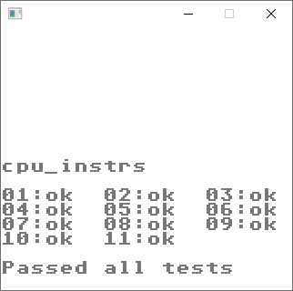

# Gameboy Emulator in C# 8

Gameboy emulator written in C# as an educational exercise (not as a production emulator).

## State

- Passing test roms section at bottom of readme
- Tetris is playable, Dr Mario is playable
- Performance is a chunk below 60fps, unsure the primary cause at the moment

## TODO

### Fixes

- Lots of test failures specified in the table below
- Pokemon blue doesn't boot - probably because I haven't tested the MBC3 implementation

### Specific

- STOP instruction implementation
- Thorough testing all opcodes through cartridges
- Test timer subsystem
- DMA testing/DMA delay
- Proper configurable serial port support
- Thorough testing of MBC function
- Prevent pressing multiple buttons (just direction keys?) at a time
- MBC !={0,1,5} support

### Ideas/Future

- Integration testing using headless runner and comparing frame buffer to known good values for variety of roms? Specifically all test roms?
- Display FPS using SDL text rendering?
- Native debugger with winforms/wpf?
- CGB/SGB support
- Cycle accuracy rather than opcode atomicity assumption
- Clean up the cartridge code to remove some of the duplication

### Known Tests

| Test                                        | Pass                  | Notes |
| ------------------------------------------- |:---------------------:| -----:|
| Blargg - cpu_instrs                         | :white_check_mark:    |       |
| Blargg - instr_timing                       | :white_check_mark:    |       |
| Blargg - interrupt_time                     | :x:                   | Hangs but ALSO REQUIRES CGB APPARENTLY!       |
| Blargg - mem_timing                         | :x:                   | Broken because CPU is using instruction atomicity       |
| Blargg - mem_timing2                        | :x:                   | Broken because CPU is using instruction atomicity       |
| Mooneye - MBC1 - bits_bank1                 | :white_check_mark:    |       |
| Mooneye - MBC1 - bits_bank2                 | :white_check_mark:    |       |
| Mooneye - MBC1 - bits_mode                  | :white_check_mark:    |       |
| Mooneye - MBC1 - bits_ramg                  | :white_check_mark:    |       |
| Mooneye - MBC1 - ram64kb                    | :white_check_mark:    |       |
| Mooneye - MBC1 - ram256kb                   | :white_check_mark:    |       |
| Mooneye - MBC1 - rom512kb                   | :white_check_mark:    |       |
| Mooneye - MBC1 - rom1Mb                     | :white_check_mark:    |       |
| Mooneye - MBC1 - rom2Mb                     | :white_check_mark:    |       |
| Mooneye - MBC1 - rom4Mb                     | :white_check_mark:    |       |
| Mooneye - MBC1 - rom8Mb                     | :white_check_mark:    |       |
| Mooneye - MBC1 - rom16Mb                    | :white_check_mark:    |       |
| Mooneye - MBC5 - rom512kb                   | :white_check_mark:    |       |
| Mooneye - MBC5 - rom1Mb                     | :white_check_mark:    |       |
| Mooneye - MBC5 - rom2Mb                     | :white_check_mark:    |       |
| Mooneye - MBC5 - rom4Mb                     | :white_check_mark:    |       |
| Mooneye - MBC5 - rom8Mb                     | :white_check_mark:    |       |
| Mooneye - MBC5 - rom16Mb                    | :white_check_mark:    |       |
| Mooneye - MBC5 - rom32Mb                    | :white_check_mark:    |       |
| Mooneye - MBC5 - rom64Mb                    | :white_check_mark:    |       |
| Mooneye - BITS - mem_oam                    | :white_check_mark:    |       |
| Mooneye - BITS - reg_f                      | :white_check_mark:    |       |
| Mooneye - BITS - unused_hwio-GS             | :white_check_mark:    |       |
| Mooneye - Instr - daa                       | :white_check_mark:    |       |
| Mooneye - Interrupts - ie_push              | :x:                   | Subtle bug relating to interrupt causing the PC to get put into the interrupt flag, not emulated |
| Mooneye - OAM_DMA - basic                   | :white_check_mark:    |       |
| Mooneye - OAM_DMA - reg_read                | :x:                   | OAM DMA currently single cycle rather than ~160 so all timing bugs expected      |
| Mooneye - OAM_DMA - sources-GS              | :x:                   | OAM DMA currently single cycle rather than ~160 so all timing bugs expected      |
| Mooneye - PPU - hblank_ly_scx_timing-GS     | :x:                   | Likely all specific timings relating to the PPU are broken, we're emulating at single instruction atomicity instead of clock cycles      |
| Mooneye - PPU - intr_1_2_timing-GS          | :x:                   | Hangs |
| Mooneye - PPU - intr_2_0_timing-GS          | :x:                   | Fails |
| Mooneye - PPU - intr_2_mode0_timing         | :white_check_mark:    |       |
| Mooneye - PPU - intr_2_mode0_timing_sprites | :x:                   | TEST #00 FAILS      |
| Mooneye - PPU - intr_2_mode3_timing         | :white_check_mark:    |       |
| Mooneye - PPU - intr_2_oam_ok_timing        | :white_check_mark:    |       |
| Mooneye - PPU - lcd_on_timing               | :x:                   | LY=1 when it should be 0 - maybe a more serious bug than the timing issues we know about      |
| Mooneye - PPU - lcdon_write_timing          | :x:                   | Loads of bad assumptions cause this failure      |
| Mooneye - PPU - stat_irq_blocking           | :x:                   | Unknown reason      |
| Mooneye - PPU - stat_lyc_onoff              | :x:                   | Fail r1 step 1 reason unknown      |
| Mooneye - PPU - vblank_stat_intr-GS         | :x:                   | Fails |
| Mooneye - Timer - div_write                 | :white_check_mark:    |       |
| Mooneye - Timer - rapid_toggle              | :x:                   | "the timer circuit design causes some unexpected timer increases" - unsure what this means in the test source so likely the cause of failure      |
| Mooneye - Timer - tim00                     | :white_check_mark:    |       |
| Mooneye - Timer - tim01                     | :white_check_mark:    |       |
| Mooneye - Timer - tim10                     | :white_check_mark:    |       |
| Mooneye - Timer - tim11                     | :white_check_mark:    |       |
| Mooneye - Timer - tim00_div_trigger         | :x:                   | Precise implementation of counts and interesting behavior of div register setting values in timer required to do this and following  |
| Mooneye - Timer - tim01_div_trigger         | :x:                   |       |
| Mooneye - Timer - tim10_div_trigger         | :x:                   |       |
| Mooneye - Timer - tim11_div_trigger         | :x:                   |       |
| Mooneye - Timer - tima_reload               | :x:                   | Requries delay in setting timer after overflow, not yet implemented      |
| Mooneye - Timer - tima_write_reloading      | :x:                   |       |
| Mooneye - Timer - tma_write_reloading       | :x:                   |       |
| Mooneye - Timing - ei_timing                | :white_check_mark:    |       |
| Mooneye - Timing - ei_sequence              | :white_check_mark:    |       |
| Mooneye - Timing - halt_ime_ei              | :white_check_mark:    |       |
| Mooneye - Timing - halt_ime0_nointr_timing  | :x:    | Unknown      |
| Mooneye - Timing - halt_ime1_timing         | :white_check_mark:    |       |
| Mooneye - Timing - halt_ime1_timing2-GS     | :x:    | Unknown      |
| Mooneye - Timing - if_ie_registers          | :white_check_mark:    |       |
| Mooneye - Timing - intr_timing              | :white_check_mark:    |       |
